# #NASU（ハッシュナス）

**「Instagram で"見つける"」と「Google Maps で"行く"」の間を埋める、栃木県那須町特化の観光ルート提案アプリ。**

写真で直感的にスポットを選ぶと、車で回れる実際の道なりルートに変換される。芝浦工業大学 システム工学特別演習 9班の成果物で、那須町での実証実験まで実施した。

**▶ ライブデモ: https://nasu-project.vercel.app/** 


<table>
<tr>
<td width="33%">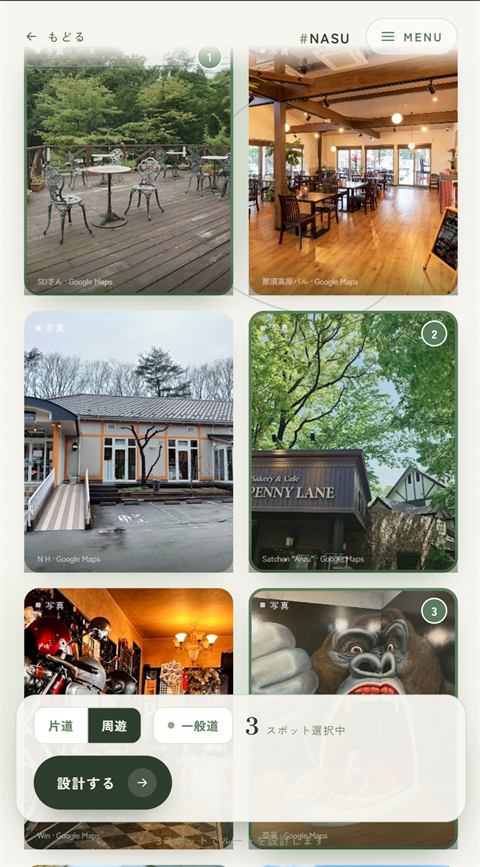</td>
<td width="33%">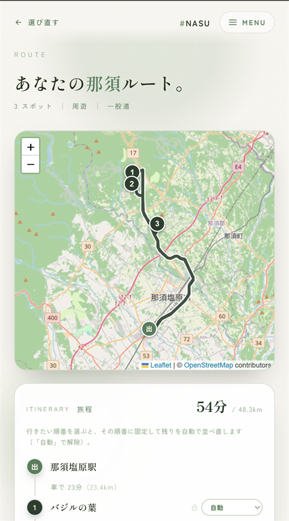</td>
<td width="33%">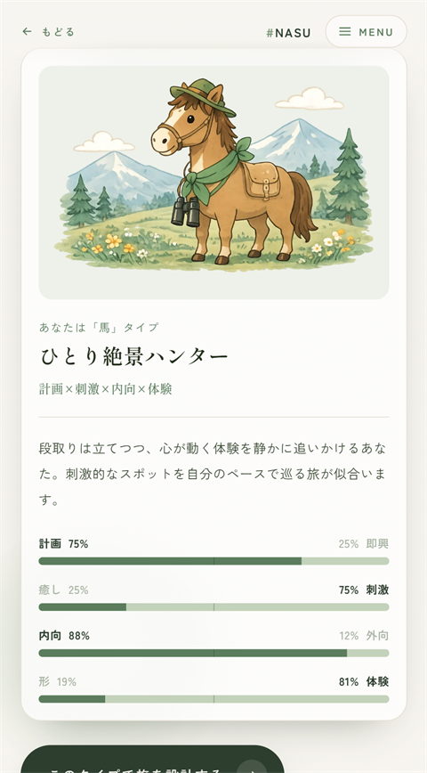</td>
</tr>
<tr>
<td align="center"><sub>写真で選ぶ</sub></td>
<td align="center"><sub>道なりルートに変換</sub></td>
<td align="center"><sub>旅タイプ診断</sub></td>
</tr>
</table>

---

## 目次

- [課題設定](#課題設定)
- [画面と機能](#画面と機能)
- [設計上の判断](#設計上の判断)
- [アーキテクチャ](#アーキテクチャ)
- [技術スタック](#技術スタック)
- [開発で解決した問題](#開発で解決した問題)
- [品質](#品質)
- [セットアップ](#セットアップ)
- [制作情報](#制作情報)

---

## 課題設定

那須町の観光には2つの課題があった。**デジタル観光体験の不足**と、**若年層の取り込み不足**である。

一方で、若年層の行動には既存サービスの隙間がある。

| 段階 | 使うもの | 起きていること |
|---|---|---|
| 見つける | Instagram | 写真で「行きたい」が生まれる |
| **繋ぐ** | **—** | **保存した写真が地名に変換されないまま溜まる** |
| 行く | Google Maps | 地名を1件ずつ入力して調べ直す |

このアプリが担うのは真ん中である。**写真を選ぶ操作がそのままルート設計になる**ようにした。

そのために2つの前提を置いた。

- **主対象は車で那須を巡る観光客**。したがってルートは直線距離ではなく、実際に走れる道なりの経路で提示する。
- **施設名はデフォルトで隠す**。名前を読ませると「知っている場所」だけを選んでしまうため、写真だけで選べる状態を初期値にした（トグルで表示切替可）。

---

## 画面と機能

### 1. ルート設計

<table>
<tr>
<td width="33%"></td>
<td width="33%"></td>
<td width="33%">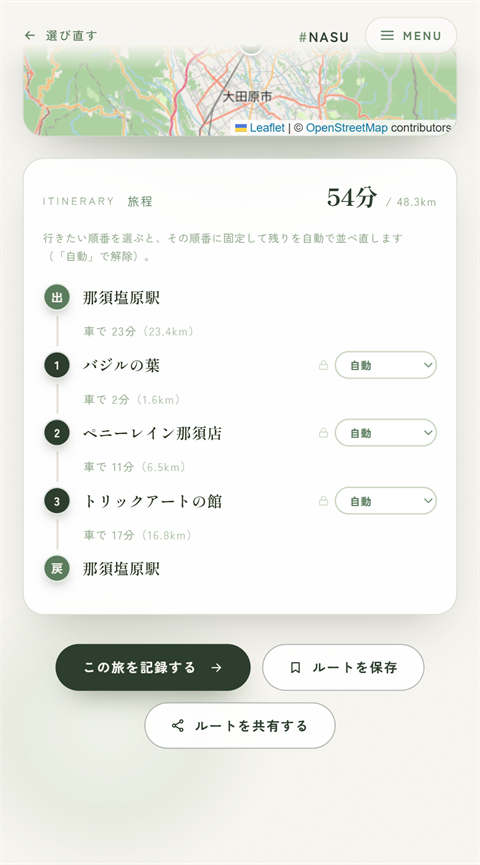</td>
</tr>
<tr>
<td align="center"><sub>① 写真グリッドで選ぶ</sub></td>
<td align="center"><sub>② 道なりルートを描画</sub></td>
<td align="center"><sub>③ 旅程と訪問順の固定</sub></td>
</tr>
</table>

- **写真グリッドでの選択** — 198スポット（うち公開191件）から選ぶ。表示順はセッションごとにランダムで、シャッフルもできる（下方のスポットに不利が出ないようにするため）
- **タグフィルター** — ジャンル11分類と「だれと」6種で絞り込み（OR判定）
- **出発地の選択** — 那須塩原駅 / 道の駅 那須高原友愛の森 / 那須IC / GPS現在地
- **巡回順の最適化** — ORS の所要時間行列を入力に自前の TSP を解く。スポット7件以下は全探索（7! = 5,040通り）、8件以上は最近傍法にフォールバック
- **訪問順の一部固定** — 「ご飯屋は1番目に行きたい」を指定すると、その位置を固定したまま残りだけを再最適化する。全探索は制約を満たす順列だけを評価し、最近傍法は固定位置を先に埋めてから貪欲に充填する。矛盾する制約（同一位置に複数指定・範囲外）は安全に無視して通常最適化に倒す
- **周遊 / 片道**、**有料道路の回避** の切替
- **ルートの共有・保存** — 結果は URL だけで完全に復元できる。Web Share API による SNS 共有と、マイページから見返せる軽量ブックマーク保存に対応

### 2. 旅タイプ診断

<table>
<tr>
<td width="25%">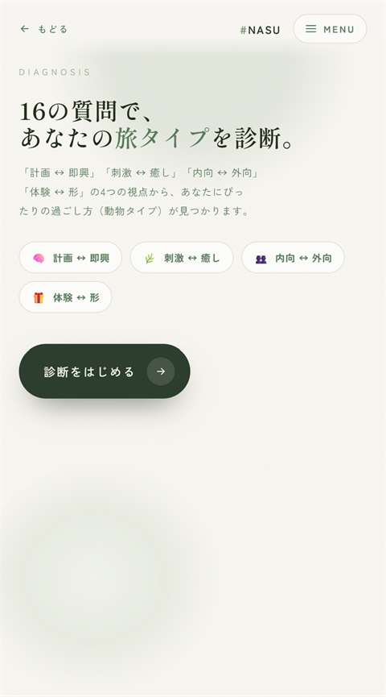</td>
<td width="25%">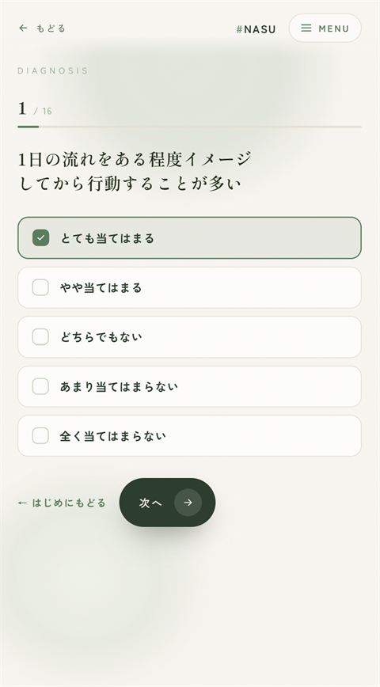</td>
<td width="25%"></td>
<td width="25%">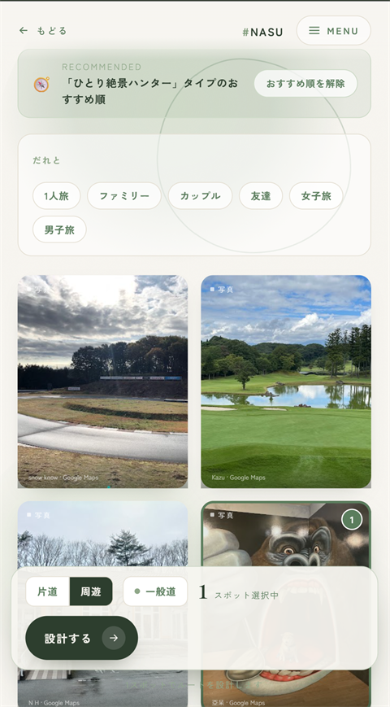</td>
</tr>
<tr>
<td align="center"><sub>① 4軸の説明</sub></td>
<td align="center"><sub>② 16問の5件法</sub></td>
<td align="center"><sub>③ 動物タイプで結果表示</sub></td>
<td align="center"><sub>④ おすすめ順に並べ替え</sub></td>
</tr>
</table>

16問の5件法を4軸（計画↔即興 / 刺激↔癒し / 内向↔外向 / 体験↔形）で採点し、各軸の合計スコア（±8）を2極に振り分けて **2⁴ = 16タイプ**に確定する。同点は正極に倒すので結果は決定的になる。

結果からそのままルート設計に進むと、`/select` が診断モードになり、**タイプの傾きに合ったジャンルのスポットほど上位**に並ぶ。ただし**ルートは自動生成しない** — スポットを選ぶのは必ずユーザー、という方針を通した。

結果は保存・共有もできる。保存は非公開・自分用で最新1件のみ、共有は結果を URL に載せるので、開いた人には結果カードと「自分も診断する」が表示される。

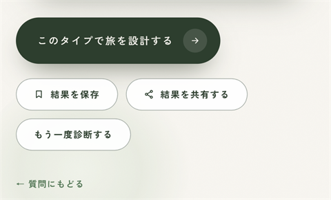

<sub>結果画面のアクション。保存・共有・そのまま旅を設計、の3方向に分岐する。</sub>

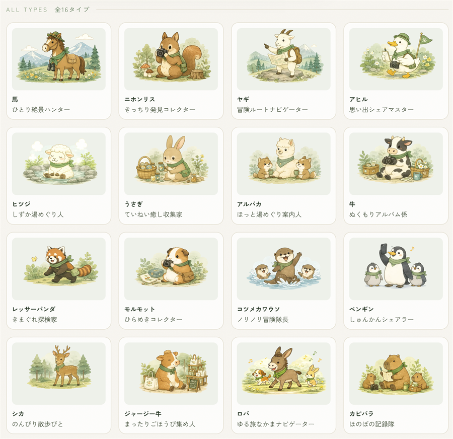

<sub>16タイプのマスコット。「深緑モノトーンの線画」というトーンを引継ぎ書に落として制作した。</sub>

### 3. 写真投稿・旅記録

<table>
<tr>
<td width="25%">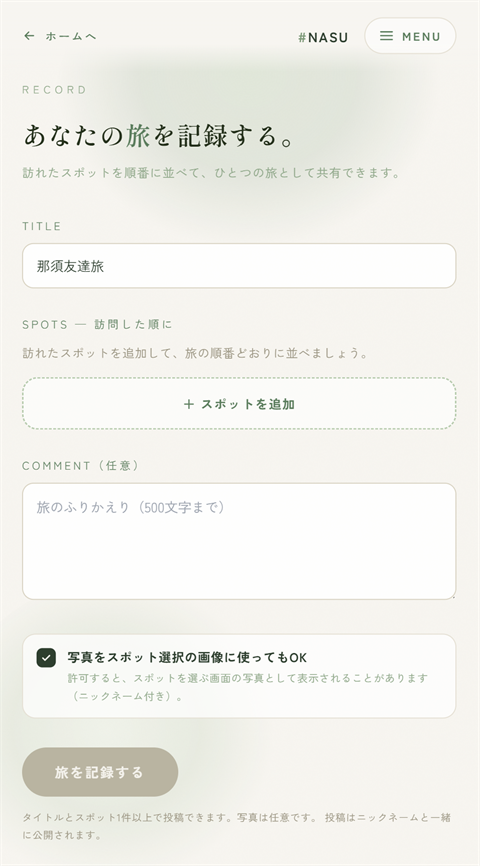</td>
<td width="25%">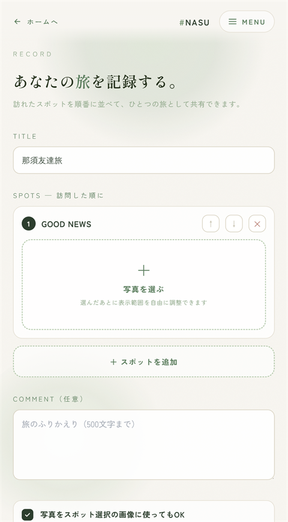</td>
<td width="25%">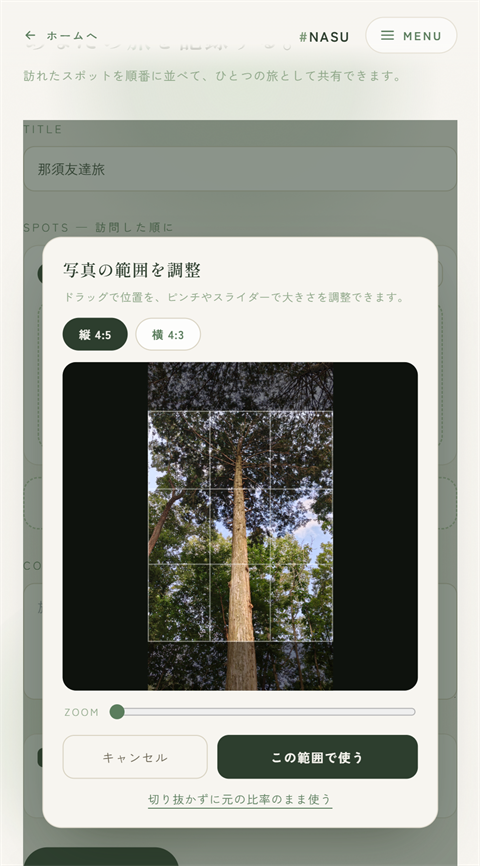</td>
<td width="25%">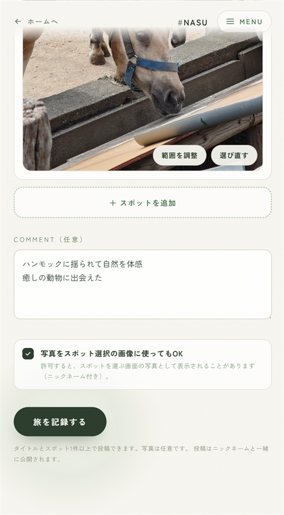</td>
</tr>
<tr>
<td align="center"><sub>① タイトルを付ける</sub></td>
<td align="center"><sub>② 訪問順に並べる</sub></td>
<td align="center"><sub>③ 表示範囲を調整</sub></td>
<td align="center"><sub>④ コメントと掲載許可</sub></td>
</tr>
</table>

<table>
<tr>
<td width="50%">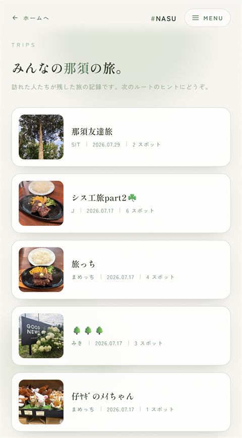</td>
<td width="50%">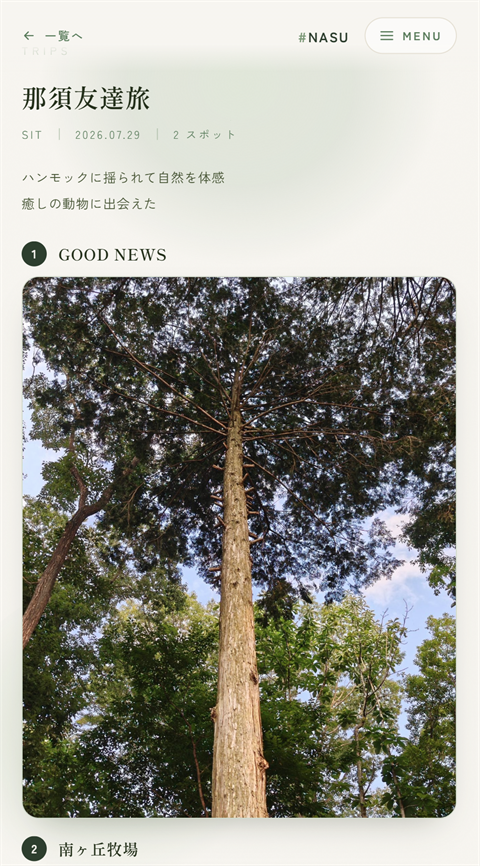</td>
</tr>
<tr>
<td align="center"><sub>みんなの旅を新着順で閲覧（ログイン不要）</sub></td>
<td align="center"><sub>詳細。ルート情報があれば地図に復元できる</sub></td>
</tr>
</table>

- **旅記録** — 訪れたスポットを順番に並べて写真付きで投稿する。ルート結果画面の「この旅を記録する」から訪問順が入った状態で始められる
- **切り抜き調整** — 自動の中央切り抜きに違和感があったため、ドラッグ・ピンチ・スライダーで範囲を決められるようにした。枠は「縦4:5 / 横4:3」の切替式で、写真の向きから自動で初期選択する（縦4:5 は選択グリッドのカードと同じ比率。縦長写真を横枠に強制するとグリッド表示時に二重切り抜きになるため）
- **グリッドへの反映** — 投稿者が許可した写真は選択画面のカードに載り、訪れるたびに違う一枚が表示される。1スポット = 1カードを保ったまま「写真が増えて画面が変わる」体験にした
- **マイページ** — 保存したルート・診断結果・投稿の管理

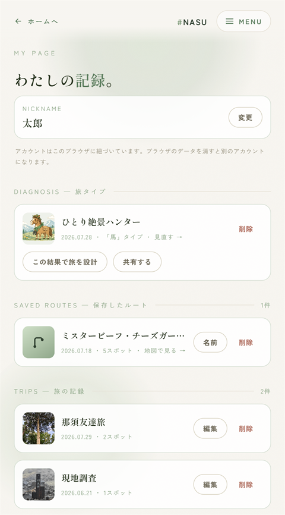

### 4. 使用感アンケート

実証実験用に9問（必須7・任意2）の匿名アンケートをアプリ内に実装した。回答は API Route 経由で Google Apps Script に転送し、スプレッドシートへ蓄積する。

現在は**運用を Google フォームに移したため、アプリ内の導線はフラグ1つで無効化**してある（`SurveyPrompt.tsx` の `SURVEY_PROMPT_ENABLED`）。実装は削除せず残してあり、戻すときは `true` にするだけでよい。

---

## 設計上の判断

このプロジェクトで「なぜそうしたか」を説明できるようにした判断を挙げる。

### 地図とGoogleを混ぜない

Google Maps Platform の規約は「Places 等の Google コンテンツを地図に表示するなら、その地図は Google Map でなければならない」「競合地図サービスとの組み合わせは禁止」と定めている。

そこで**地図側を完全に Google 非依存**にした。座標は国土地理院・OSM 由来、経路は OpenRouteService、描画は Leaflet + OpenStreetMap。Google を使うのは**グリッドの写真だけ**で、写真は地図の外にしか出さない。

| データ | 出どころ | 保存 | 表示場所 |
|---|---|---|---|
| 緯度経度 | 国土地理院 / OSM | 可 | 地図（Leaflet） |
| 経路形状 | OpenRouteService | 可 | 地図（Leaflet） |
| place_id | Google Places | 可（キャッシュ制限の例外） | 内部利用のみ |
| 写真 | Google Places | **不可**・毎回動的取得 | 地図外のグリッド |

規約を「守れているか」ではなく「**守れる構造になっているか**」で解いた点が要点である。データの出どころを層で分離したので、写真が地図に混入する経路がそもそも存在しない。

### 状態はすべて URL に載せる

ルートの条件（スポット・出発地・周遊/片道・有料道路・訪問順の固定）も、診断の結果（タイプ・4軸スコア）も、**すべて URL のクエリで表現**する。

```
/route?spots=chausu,shikanoyu&dep=nasushiobara-station&trip=roundtrip&tolls=1&lock=chausu:1
/diagnosis?type=phnx&plan=6&desire=-4&social=8&value=5
```

エンコード / デコードは `routeQuery.ts` と `diagnosisQuery.ts` に集約し、不正値は安全側（無視して通常動作）に倒す。これにより次の4つが**追加実装なしで**成立する。

1. リンク共有 — 共有ボタンは現在の検索文字列を繋ぐだけ
2. リロード復元
3. 保存機能 — DB に持つのはクエリ文字列1本だけでよい
4. 機能間の連携 — 診断から選択画面へは URL を組み立てて遷移するだけ

保存テーブルのカラムが `route_query` / `result_query` の1本で済んでいるのは、この判断の直接の帰結である。

### 診断は「タイプごとの手書きリスト」を作らない

16タイプそれぞれに推薦スポットを手で書くと、16 × スポット数の対応表を保守することになり、スポットが増えるたびに破綻する。

代わりに**「極 → ジャンル」の対応表を1枚だけ**持ち（`POLE_GENRES`）、タイプの推薦はそこから機械的に導出する。スコアは連続値をそのまま重みに使うため、**傾きが強い軸ほど並びに強く効く**。

```
スコア = Σ（各寄与軸）｛ |ユーザーの傾き| / 8 × スポットが傾き側のジャンルを持てば 1、無ければ 0 ｝
```

現在寄与するのは2軸だけだが、**表にエントリを足すだけで寄与軸を増やせる**構造にしてある。16タイプ × 傾きパターンで上位や階層別件数を出す検証スクリプト（`scripts/verify-diagnosis-scoring.ts`）も用意した。

### 「最新1件だけ」をアプリではなく DB で保証する

診断結果は履歴を持たず最新1件だけを残す仕様にした。これをアプリ側で「保存前に古い行を消す」と実装すると、消し忘れや競合で破れる。

そこで **`diagnoses` テーブルの主キーを `user_id` にした**。`upsert(onConflict: "user_id")` で書くので、何度診断しても行は構造上1つしか存在しえない。読み出しも `maybeSingle()` 1回で済む。

### 認証は「投稿ボタンを押した瞬間」まで発火させない

演習アプリの倫理面への配慮からメールアドレス等は集めず、**匿名認証＋ニックネーム**にした。閲覧はログイン不要である。

ただし匿名認証を画面表示のタイミングで走らせると、見ただけのユーザーが全員アカウントになってしまう。そこで**投稿ボタンを押した瞬間**に初めてサインインし、プロフィール未作成ならニックネーム入力を挟む（`ensureSignedInWithProfile()`）。

さらに「保存」系の機能は**ニックネームすら要求しない**。ルート保存と診断保存は自分にしか見えないので、匿名セッションだけで発火する（`ensureAnonSession()`）。要求する情報量を機能ごとに最小化した。

### 保存したルートと旅記録を別物として設計する

似た機能に見えるが、時点も公開範囲も違うので統合しなかった。

| | 保存したルート | 旅記録 |
|---|---|---|
| いつ | 出発前（プラン段階） | 旅の後 |
| 中身 | ルートのみ（クエリ1本） | タイトル + 訪問エントリ + 写真 + コメント |
| 公開 | 非公開（自分だけ） | 公開 |
| 必要な情報 | 匿名セッションのみ | ニックネーム必須 |

RLS も分けてある。旅記録は「読み取り全公開・書き込み本人のみ」だが、保存ルートと診断結果は**読み取りも本人のみ**である。

### 背景演出のパフォーマンス方針を明文化する

デザインの初期実装がスクロールで重くなったため、原因を特定して**禁止手法として文書化**した。

| 禁止 | 理由 | 代替 |
|---|---|---|
| 大きな要素への `filter: blur()` | 再描画コストが高い | 端が透明にフェードする `radial-gradient` |
| `backdrop-filter` | スクロールごとに背後を再ぼかし | 不透明度 .92〜.95 の単色背景 |
| `mix-blend-mode` | 全画面の再合成を強制 | 通常合成 + 低 opacity |
| カーソル追従パララックス（rAF） | 毎フレーム JS が走る | CSS アニメーション（`transform` のみ） |

「速くした」で終わらせず、**再発しないように理由込みで残した**点を重視した。

### 写真の自動切替は「選択の邪魔をしない」条件でだけ動かす

スポットカードは写真が複数あるとき8秒ごとにクロスフェードする。ただし **カードは写真であると同時に選択コントロールでもある**ため、条件を満たすときだけタイマーを回している。

| 止める条件 | 理由 |
|---|---|
| カードが画面外 | 見えていないカードで回しても意味がない |
| hover 中 | 触っている最中に絵が変わると、気に入った写真でタップしたつもりが別の写真になる |
| 選択済み | 選んだ後に絵が変わらないようにする |
| `prefers-reduced-motion: reduce` | 動きを減らす設定の尊重 |
| 写真が1枚 | 約200枚のグリッドで無駄なタイマーを作らない |

描画・通信量の対策として、**DOM に置く写真は常に最大2枚**（表示中＋直前の1枚）、**先読みは次の1枚だけ**にしている。さらに **次の1枚が読み込めるまで切り替えない**：読めていないまま進めると透明な新レイヤーが前の写真を隠し、カードが下地に抜ける（実装中に実際に起きたので、フェード開始を `onLoad` に紐づけた）。使うのは opacity の transition だけなので、上表の禁止手法には触れていない。

---

## アーキテクチャ

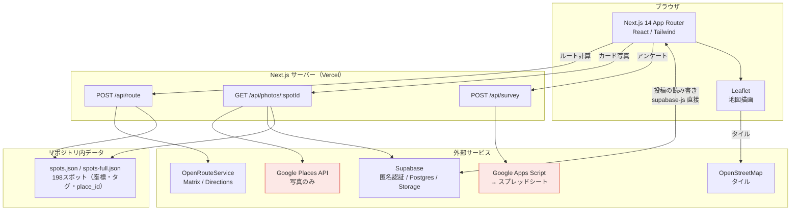

**サーバーを経由するのは秘密鍵が要る処理だけ**にしてある。ORS と Places のキーはサーバー専用なので API Route を通し、Supabase は公開前提の anon キー + RLS で守られているのでブラウザから直接叩く（API Route を挟んでも防御は増えないため）。

### ルート計算の流れ

```
選択スポット + 出発地
   ↓  ORS Matrix API
所要時間行列
   ↓  solveTSP(matrix, roundTrip, locks)     ≤7件: 全探索 / ≥8件: 最近傍法
訪問順
   ↓  ORS Directions API（GeoJSON）
道なりの経路形状
   ↓
Leaflet Polyline + タイムライン
```

計算部は `calculateRoute(spots, departure, tripType, avoidTolls, locks)` という **UI から独立した1つの関数**にまとめてあり、ORS クライアントをモックすればページを描画せずにテストできる。巡回順の決定（`solveTSP`）は外部通信を含まない純粋関数なので単体で検証できる。

### ディレクトリ構成

```
src/
├── app/                    # App Router（ページ + API Route）
│   ├── select/             # スポット選択（診断モードを内包）
│   ├── route/              # ルート結果（地図 + タイムライン）
│   ├── diagnosis/          # 旅タイプ診断
│   ├── trips/              # 旅記録（一覧 / 詳細 / 作成）
│   ├── me/                 # マイページ
│   └── api/                # route / photos / survey
├── components/             # UI コンポーネント
├── lib/                    # ドメインロジック（テスト対象）
│   ├── calculateRoute.ts   # ルート計算の独立関数
│   ├── tsp.ts              # 巡回順最適化（全探索 / 最近傍 / 位置固定）
│   ├── ors.ts              # ORS クライアント（リトライ + タイムアウト）
│   ├── diagnosis.ts        # 診断の軸・設問・16タイプ・採点・推薦スコア
│   ├── routeQuery.ts       # ルート条件 ⇄ URL
│   ├── diagnosisQuery.ts   # 診断結果 ⇄ URL
│   └── spotTags.ts         # タグの2軸解釈（ジャンル / 同行者）
└── types/                  # 型定義
data/                       # スポットマスタ（JSON + 調査CSV）
supabase/                   # スキーマ + RLS + マイグレーション
scripts/                    # データ生成・検証スクリプト
docs/                       # 設計ドキュメント
```

### 画面一覧

| URL | 画面 | 備考 |
|---|---|---|
| `/` | ホーム | |
| `/select` | 出発地・スポット選択 | 診断クエリ付きで「おすすめ順」モードになる |
| `/route?spots=..&dep=..` | ルート結果（地図 + タイムライン） | URL 単体で共有・復元できる |
| `/diagnosis` | 旅タイプ診断 | 結果クエリ付きで共有された結果を表示する |
| `/post` | 写真の単体投稿 | |
| `/trips` · `/trips/[id]` · `/trips/new` | 旅記録の一覧 / 詳細 / 作成 | 閲覧はログイン不要 |
| `/me` | マイページ | 保存ルート・診断結果・投稿の管理 |
| `/survey` | 使用感アンケート | 実装済み。アプリ内導線は現在オフ |
| `/admin/diagnosis-types` | 16タイプのプレビュー | Basic 認証。ナビ非掲載 |

---

## 技術スタック

| 区分 | 採用 | 選定理由 |
|---|---|---|
| フロント | Next.js 14 (App Router) + TypeScript | API Route を同一リポジトリに置けるため、キーの秘匿とフロントを1つのデプロイで完結できる |
| スタイル | Tailwind CSS | — |
| 地図 | Leaflet + OpenStreetMap | Google 規約との衝突を構造的に避けるため（[設計上の判断](#地図とgoogleを混ぜない)） |
| 経路探索 | OpenRouteService `driving-car` | OSM ベースで道なり経路・距離・時間・有料道路回避に対応。無料枠で足りる |
| 巡回順最適化 | 自前 TSP（全探索 / 最近傍法） | 訪問順の一部固定という要件がライブラリでは表現しづらいため |
| 写真 | Google Places API (New) | place_id から動的取得。規約上キャッシュしない |
| DB / 認証 / ストレージ | Supabase | 匿名認証・Postgres・Storage・RLS が無料枠で揃うため |
| テスト | Vitest | 58テスト（9ファイル） |
| CI / デプロイ | GitHub Actions / Vercel | — |

---

## 開発で解決した問題

実際に詰まって原因を特定した項目を残している。

### Next.js が Route Handler 内の fetch をキャッシュしていた

**症状**: 投稿を削除したのに選択画面から写真が消えない。Google 写真の URL がキャッシュされ、規約上も問題のある状態になっていた。

**原因**: Next.js 14 は GET Route Handler とその中の `fetch` をデフォルトで Data Cache に載せる。**supabase-js が内部で使う fetch も対象**だった。

**対処**: Route Handler に `export const dynamic = "force-dynamic"` を宣言し、さらに supabase-js のクライアント生成時に fetch を差し替えて `cache: "no-store"` を素通しさせた。片方だけでは足りない。

### ORS の公開エンドポイントが移行期間中に不均一に壊れた

**症状**: 本番で **Matrix は通るのに Directions だけ 504 やハング**を起こす。ローカルでは再現しにくい。

**原因**: 旧ドメイン `api.openrouteservice.org` の廃止告知後、移行期間中に旧ドメインのクォータが絞られていた。障害が API 単位で不均一に出るため切り分けに時間がかかった。

**対処**: base URL を `api.heigit.org` に差し替え（キーと形式は同一）。あわせて、公開インスタンスが混雑時に不安定なことを前提に、**AbortController によるタイムアウト + 一時エラー（429 / 5xx / 切断）のバックオフ付きリトライ**を実装した（Directions 3回・Matrix 2回）。

### 座標が「車で行けない場所」だとルート計算が失敗する

ORS は車道に吸着できない座標を渡すと計算に失敗するか、極端な遠回りを返す。茶臼岳（山頂）や那須ロープウェイ（山中）がこれに該当した。**最寄りの駐車場・ロープウェイ乗り場の座標に補正**して解決し、スポット追加時の確認事項としてドキュメント化した。

### ORS と Leaflet で座標の順序が逆

ORS は `[経度, 緯度]`、Leaflet は `[緯度, 経度]`。型エイリアス `type LngLat = [number, number]` を定義し、渡す直前に `[s.lng, s.lat]` と明示する形に統一した。

### 写真 API のコストが実測で見えた

選択画面の全カードを一斉に読み込むと、1スポット = 1リクエストで課金される。**カードが画面に近づいてから取得する遅延読み込み**（`IntersectionObserver`、先読み 250px）にして消費を抑えた。

このコスト構造は請求データとコードを突き合わせて監査し、外部依存の棚卸しとして文書化してある（Places / ORS / OSM タイルなど、「呼ぶたびに消費されキャッシュできない」依存が他にもあることを確認した）。

### API クレジット終了後も画面が成立するようにする

授業で使っていた Google Cloud の無料クレジットが終了し、Places API の写真取得が止まった。このとき `fetchGooglePhotos` は例外を投げず **静かに 0 件を返す**設計なので、エラーは出ないまま選択グリッドが無地のパネルだらけになる。公開を続けるポートフォリオとして、**残っている投稿写真（実証実験の現地調査ぶん・198スポット中10スポット）だけで画面が成立する**ように直した。

- **写真のあるスポットを先頭に並べた**: `GET /api/photos/coverage` が掲載許可された投稿写真を持つスポットの id を返し、`/select` がそれを並べ替えのキーに使う。ソートキーは ①診断スコア降順（診断モードのみ）→ ②写真あり → ③ランダム順で、`Array.sort` の安定性により同じ帯の中のランダム性とシャッフルの挙動は元のまま。写真が増えれば自動で先頭に入る。
- **写真ゼロのカードを設計に含めた**: 写真が無いときは施設名とジャンルを必ず表示する（施設名スイッチが OFF でも）。「読み込み失敗」ではなく「テキストカード」として読める。読み込みに失敗した画像URLも候補から外して残りの写真に倒す。
- **事情をサイト上に書いた**: 選択画面に注記（`DemoNotice`）を置き、写真取得を止めている理由・現在の写真ソース・運用時の画面（この README のスクリーンショット）へのリンクを明示している。APIキーを設定すればコード変更なしで元の動作に戻る。

**Google の写真をダウンロードして再ホストするのは規約違反**（キャッシュ禁止）なので、穴埋めにその手は使っていない。

### Supabase 無料枠の一時停止対策

Supabase の無料プロジェクトは一定期間アクセスがないと停止する。実証実験中に止まると回答が取れないため、**GitHub Actions の cron で週2回 REST に ping を打つ** workflow を用意した（`.github/workflows/keep-alive.yml`）。

---

## 品質

- **テスト**: Vitest で **58テスト / 9ファイル**。ドメインロジック（TSP・ルート計算・URL エンコード/デコード・診断採点・タグ解釈・スポット検索・ORS クライアント）と、ORS をモックしたルート計算の結合テストを対象にしている
- **CI**: GitHub Actions で push / PR ごとにテストを実行
- **型**: TypeScript strict。Vitest は型を見ないため、push 前に `tsc --noEmit` を別途通す運用にしている
- **ブランチ運用**: `main` は常に動く状態を保ち、細かい修正でも機能ブランチを切ってからマージする

```bash
npm test           # 58テストを実行
npm run test:cov   # カバレッジ付き
npx tsc --noEmit   # 型チェック
```

---

## セットアップ

### 1. インストール

```bash
npm install
```

### 2. 環境変数

```bash
cp .env.example .env.local
```

| 変数 | 用途 |
|---|---|
| `GOOGLE_PLACES_API_KEY` | Places API (New) を有効化したキー。**アプリケーションの制限は「なし」または「IPアドレス」**にする（サーバーサイドから呼ぶためリファラー制限は 403 になる） |
| `ORS_API_KEY` | [openrouteservice.org](https://openrouteservice.org/dev/#/) の新形式トークン（長い16進数）。旧 `eyJ...` 形式は使えない |
| `NEXT_PUBLIC_SUPABASE_URL` | Supabase の Project URL |
| `NEXT_PUBLIC_SUPABASE_ANON_KEY` | anon キー（公開前提。防壁は RLS。`service_role` はどこにも置かない） |
| `NEXT_PUBLIC_SPOTS_MODE` | `debug`（13件・既定） / `full`（198件・本番） |
| `SURVEY_WEBHOOK_URL` | Apps Script Web App の URL（アンケート用・サーバー専用） |
| `ADMIN_USER` / `ADMIN_PASSWORD` | `/admin/*` の Basic 認証 |

Supabase の作成手順は [supabase/SETUP.md](supabase/SETUP.md) を参照。`.env.local` を変更したら dev サーバーを再起動すること（Next.js は環境変数をホットリロードしない）。

### 3. 起動

```bash
npm run dev   # http://localhost:3000
```

### スポットデータの生成

本番用の198件は調査 CSV から生成する。

```bash
npx tsx scripts/build-spots-full.ts
```

既存13件は同じ id のまま含まれるため、モードを切り替えても DB の `spot_id` 参照は壊れない。**公開後の id は変更・削除しない**（リネームは名前のみ）。

> **注意**: 座標は Google Places 由来にせず、調査データ・国土地理院・OSM から取得すること。山頂など車道のない地点は最寄りの駐車場の座標を使うこと。

### デプロイ（Vercel）

本番は https://nasu-project.vercel.app/ で公開している。GitHub リポジトリを接続すると main への push で本番が更新され、PR ごとにプレビュー URL が立つ。Environment Variables に上記と同じ変数を登録する（`NEXT_PUBLIC_SPOTS_MODE` は `full`）。

- Vercel のサーバー関数は IP が動的なので、Google Places キーは「アプリケーションの制限=なし」＋「API の制限で Places API (New) のみ」に絞り、**予算アラートを設定する**（写真は1リクエストずつ課金される）。
- **公開URLは誰でも匿名で投稿できる**。限定公開にしたい場合は Vercel の Password Protection 等を検討する。

---

## 制作情報

- **チーム**: 芝浦工業大学 システム工学特別演習 9班
- **担当範囲**: アプリケーション全体の設計・実装、実証実験の設計
- **期間**: 2026年5月～2026年7月
- **設計ドキュメント**: [CLAUDE.md](CLAUDE.md)（アーキテクチャと判断の記録）、[docs/](docs/)（診断ロジックの詳細・キャラクターデザイン引継ぎ書）

### ライセンス

本リポジトリは学習・研究目的のものです。地図データは © OpenStreetMap contributors、経路探索は openrouteservice を利用しています。
